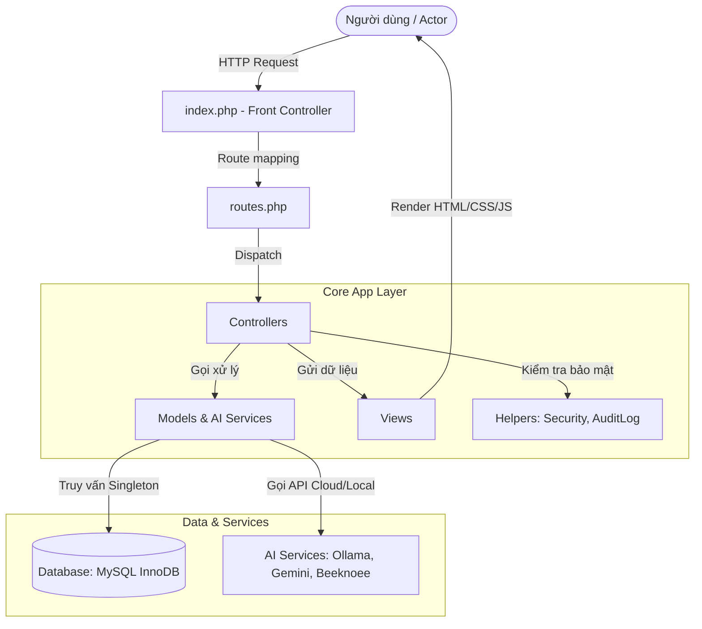
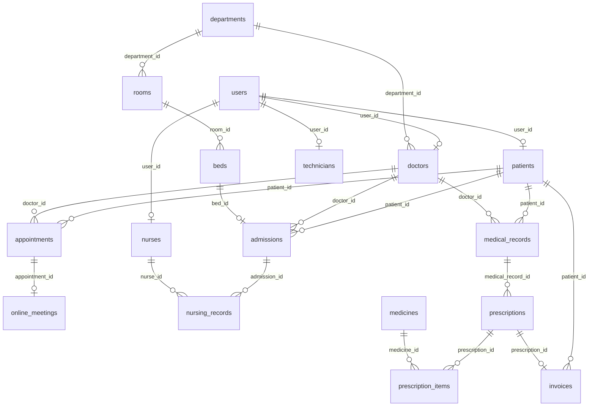

# 🏥 Tài Liệu Đặc Tả Dự Án NovaCare 4.0

## Hệ Thống Quản Lý Bệnh Viện Thông Minh (Smart Hospital Management System)

NovaCare là một hệ thống quản lý bệnh viện thông minh toàn diện, được phát triển trên nền tảng **Vanilla PHP (PHP thuần)** kết hợp với cơ sở dữ liệu **MySQL**, hoạt động theo mô hình kiến trúc **Monolithic MVC** hiện đại. Hệ thống tích hợp các công nghệ tiên tiến bao gồm Trợ lý AI y tế (Google Gemini, Beeknoee, Ollama), hệ thống giám sát thời gian thực (Real-time Queue), tích hợp cổng thanh toán trực tuyến (VNPay, MoMo) và hệ thống phân quyền chặt chẽ (RBAC) cùng cơ chế Audit Log bảo mật.

---

## 1. Kiến Trúc Hệ Thống (System Architecture)

Dự án được triển khai dưới dạng **Monolithic MVC** tinh gọn, đảm bảo hiệu năng cao, dễ bảo trì và cài đặt.

### 1.1 Sơ đồ luồng dữ liệu (Data & Execution Flow)



### 1.2 Entry Point & Routing

* **Front Controller (`index.php`):** Là điểm tiếp nhận duy nhất cho mọi HTTP Request. Nó chịu trách nhiệm khởi tạo Session, tải cấu hình database, kiểm tra đăng nhập, cấu hình CSRF token và chuyển giao quyền xử lý cho các Controller tương ứng dựa vào tham số trên URL (`page` và `action`).
* **Định tuyến (`routes.php`):** Định nghĩa một mảng ánh xạ giữa giá trị `page` (URL) và Controller Class chịu trách nhiệm tương ứng.

### 1.3 Cơ chế Kết nối Cơ sở dữ liệu (Database Connection)

Hệ thống sử dụng mẫu thiết kế **Singleton** thông qua file cấu hình `config/database.php` nhằm duy trì một kết nối duy nhất (PDO Instance) trong suốt vòng đời của một Request, giảm thiểu tải và tối ưu hóa hiệu năng truy vấn của máy chủ.

---

## 2. Bảo Mật & Tiện Ích Hệ Thống (Security & System Helpers)

Hệ thống NovaCare áp dụng các tiêu chuẩn bảo mật y tế nghiêm ngặt thông qua các lớp Helper chuyên biệt:

* **Mật khẩu an toàn (Bcrypt):** Toàn bộ mật khẩu người dùng được mã hóa bằng thuật toán `bcrypt` mạnh thông qua lớp [Security](file:///d:/wamp64/www/NovaCare/helpers/Security.php), chống tấn công vét cạn cơ sở dữ liệu.
* **Chống giả mạo CSRF (Cross-Site Request Forgery):** Mọi tác vụ thay đổi trạng thái hoặc thêm mới dữ liệu bằng phương thức `POST` đều được hệ thống tự động kiểm tra CSRF Token được sinh duy nhất theo mỗi Session.
* **Chống rò rỉ dữ liệu IDOR (Insecure Direct Object Reference):** Hệ thống kiểm tra quyền sở hữu dữ liệu cấp dòng (Data-level security), đảm bảo bệnh nhân chỉ được xem bệnh án của chính họ, bác sĩ chỉ xem danh sách bệnh nhân liên kết hoặc do mình phụ trách.
* **Kiểm soát quyền truy cập RBAC (Role-Based Access Control):** Phân quyền nghiêm ngặt dựa theo vai trò của người dùng trên toàn bộ các phương thức xử lý ở Controller.
* **Hệ thống Kiểm toán (Audit Logs):** Bất cứ hành động ghi (`INSERT`), sửa (`UPDATE`), xóa (`DELETE`) hay đăng nhập (`LOGIN`) của nhân viên hoặc bệnh nhân đều được tự động ghi nhận lại chi tiết trong bảng `audit_logs` (lưu cả dữ liệu cũ và mới dưới dạng JSON, cùng địa chỉ IP).

---

## 3. Cấu Trúc Cơ Sở Dữ Liệu (Database Schema)

Cơ sở dữ liệu của NovaCare sử dụng Storage Engine **InnoDB** hỗ trợ toàn vẹn tham chiếu khóa ngoại (Foreign Keys), Triggers và Transactions.

### 3.1 Sơ đồ mối quan hệ giữa các bảng chính



### 3.2 Mô tả chi tiết 31 bảng trong hệ thống

1. **`users`:** Lưu thông tin tài khoản trung tâm (Họ tên, email, mật khẩu hash bcrypt, số điện thoại, vai trò và trạng thái hoạt động).
2. **`patients`:** Kế thừa từ `users`, lưu thông tin đặc thù của bệnh nhân (ngày sinh, giới tính, địa chỉ, nhóm máu, tiền sử bệnh lý, mã số bảo hiểm y tế).
3. **`doctors`:** Kế thừa từ `users`, lưu thông tin bác sĩ (chuyên khoa, số năm kinh nghiệm, mô tả tiểu sử, khoa công tác chính).
4. **`nurses`:** Kế thừa từ `users`, lưu thông tin điều dưỡng (khoa công tác, trạng thái điều dưỡng trưởng).
5. **`technicians`:** Kế thừa từ `users`, lưu thông tin kỹ thuật viên xét nghiệm/chẩn đoán hình ảnh (chuyên môn kỹ thuật).
6. **`departments`:** Danh mục khoa phòng khám của bệnh viện (Nội, Ngoại, Tim mạch, Thần kinh, Xét nghiệm...).
7. **`doctor_departments`:** Bảng trung gian liên kết nhiều khoa phòng khám cho bác sĩ (cho phép một bác sĩ trực ở nhiều khoa khác nhau).
8. **`examination_rooms`:** Phòng khám bệnh chuyên khoa của bác sĩ, liên kết trực tiếp với một bác sĩ trực.
9. **`rooms`:** Danh sách phòng bệnh nội trú (phân loại: tiêu chuẩn, VIP, ICU) kèm đơn giá mỗi ngày.
10. **`beds`:** Danh sách giường bệnh cụ thể trong từng phòng nội trú, trạng thái trống hay có người (`available`/`occupied`).
11. **`admissions`:** Lịch sử nhập viện và quản lý giường của bệnh nhân điều trị nội trú.
12. **`nursing_records`:** Phiếu chăm sóc của điều dưỡng (cập nhật sinh hiệu hàng ngày: nhiệt độ, huyết áp tâm thu/tâm trương, nhịp tim, nhịp thở, SpO2 và y lệnh thuốc).
13. **`appointments`:** Quản lý lịch hẹn khám trực tiếp hoặc trực tuyến của bệnh nhân.
14. **`online_meetings`:** Phòng khám trực tuyến từ xa (Telemedicine), lưu mã phòng và đường dẫn phòng họp trực tuyến.
15. **`medical_records`:** Hồ sơ bệnh án điện tử (EMR) của bệnh nhân sau khi khám, lưu chẩn đoán, phác đồ điều trị và mã bệnh ICD-10.
16. **`icd10_codes`:** Danh mục mã hóa bệnh tật chuẩn quốc tế ICD-10 phục vụ tìm kiếm autocomplete khi bác sĩ chẩn đoán.
17. **`prescriptions`:** Đơn thuốc điện tử liên kết với bệnh án của bệnh nhân.
18. **`prescription_items`:** Chi tiết các thuốc được kê trong đơn (liều lượng, thời gian uống, hướng dẫn sử dụng).
19. **`medicines`:** Kho dược bệnh viện (quản lý số lượng tồn kho thực tế, số lượng đã giữ chỗ cho đơn chờ phát, hạn sử dụng và giá).
20. **`services`:** Danh mục dịch vụ cận lâm sàng của bệnh viện (X-quang, MRI, xét nghiệm máu, siêu âm) kèm đơn giá.
21. **`patient_services`:** Bản ghi các dịch vụ kỹ thuật mà bệnh nhân đã thực hiện.
22. **`lab_orders`:** Phiếu chỉ định xét nghiệm hoặc chẩn đoán hình ảnh từ bác sĩ điều trị.
23. **`lab_results`:** Kết quả xét nghiệm do kỹ thuật viên thực hiện (lưu kết luận chỉ số, giá trị bình thường, và tải lên hình ảnh chụp chiếu X-quang/MRI).
24. **`medical_devices`:** Danh mục các thiết bị y tế kỹ thuật cao (máy đo điện tim, máy siêu âm, máy chụp MRI) giúp giám sát phân bổ theo khoa.
25. **`equipment`:** Danh mục cơ sở vật chất, thiết bị tiện ích trong bệnh viện.
26. **`queue_tickets`:** Quản lý hàng đợi khám bệnh thông minh theo ngày (lưu số thứ tự, trạng thái chờ/đã gọi/đang khám/hoàn thành/hủy).
27. **`shifts`:** Lịch phân ca trực chung (ca ngày/ca đêm) theo các khoa phòng khám.
28. **`doctor_shifts`:** Đăng ký và phân ca trực cụ thể cho bác sĩ.
29. **`nurse_shifts`:** Đăng ký và phân ca trực cụ thể cho điều dưỡng.
30. **`notifications`:** Hộp thư thông báo nội bộ cho người dùng (nhắc lịch khám, nhắc ca trực, hóa đơn mới).
31. **`audit_logs`:** Ghi nhận nhật ký thao tác kiểm toán dữ liệu.

### 3.3 Cơ chế Trigger toàn vẹn dữ liệu

Để đảm bảo tính nhất quán của dữ liệu thực tế mà không cần viết quá nhiều code PHP, cơ sở dữ liệu tích hợp các triggers:

* **`trg_admission_before_insert`:** Kiểm tra xem giường bệnh được chỉ định có đang ở trạng thái trống (`available`) hay không trước khi lưu hồ sơ nhập viện. Nếu giường đã có người (`occupied`), trigger sẽ gửi tín hiệu báo lỗi chặn ghi.
* **`trg_admission_after_insert`:** Tự động chuyển đổi trạng thái giường bệnh sang `occupied` ngay sau khi bệnh nhân nhập viện thành công.
* **`trg_admission_after_update`:** Tự động chuyển đổi trạng thái giường bệnh về `available` khi bệnh nhân làm thủ tục xuất viện (`discharged`).

---

## 4. Chi Tiết Vai Trò & Nghiệp Vụ Sử Dụng (Actors & Use Cases)

Hệ thống NovaCare vận hành khép kín quy trình khám chữa bệnh thông qua 9 vai trò người dùng:

```
                  ┌─────────────────────────────────────────┐
                  │                 Patients                │ (Đăng ký, Đặt hẹn, Xem EMR, Thanh toán)
                  └────────────────────┬────────────────────┘
                                       │
                  ┌────────────────────┼────────────────────┐
                  ▼                    ▼                    ▼
        ┌───────────────────┐┌───────────────────┐┌───────────────────┐
        │   Receptionist    ││      Doctors      ││      Nurses       │
        │(Tiếp đón, Xếp hàng││(Khám, AI Gợi ý,   ││(Nhận nội trú, Phân│
        │ chờ, Duyệt hẹn)   ││ Kê đơn, Lab order││ giường, Ghi vitals│
        └───────────────────┘└───────────────────┘└───────────────────┘
                                       │
                  ┌────────────────────┼────────────────────┐
                  ▼                    ▼                    ▼
        ┌───────────────────┐┌───────────────────┐┌───────────────────┐
        │    Technicians    ││    Pharmacists    ││     Cashiers      │
        │(Nhận chỉ định, Cập││(Duyệt & Cấp phát  ││(Tính tiền BHYT,   │
        │ nhật KQ xét nghiệm││ thuốc, Trừ kho)   ││ thu viện phí)     │
        └───────────────────┘└───────────────────┘└───────────────────┘
                                       │
                                       ▼
                         ┌───────────────────────────┐
                         │   Directors & Admins      │ (Xem Dashboard dự báo AI,
                         │                           │  Quản trị hệ thống, RBAC)
                         └───────────────────────────┘
```

1. **Bệnh nhân (Patient):** Đăng ký tài khoản trực tuyến, tự quản lý hồ sơ cá nhân, đặt lịch khám theo giờ với bác sĩ, theo dõi số thứ tự khám trực tuyến, xem đơn thuốc, lịch sử bệnh án và tự thanh toán hóa đơn bằng **VNPay/MoMo**.
2. **Lễ tân (Receptionist):** Tiếp nhận thông tin bệnh nhân đăng ký trực tiếp, phê duyệt hoặc hủy các lịch hẹn đăng ký online, cấp phát số thứ tự đưa bệnh nhân vào hàng đợi của phòng khám chuyên khoa.
3. **Bác sĩ (Doctor):** Theo dõi hàng đợi bệnh nhân tại phòng khám của mình, tra cứu bệnh án cũ, nhập thông tin chẩn đoán lâm sàng bằng mã hóa **ICD-10 Autocomplete**, kê đơn thuốc điện tử, yêu cầu xét nghiệm cận lâm sàng hoặc chỉ định nhập viện.
4. **Điều dưỡng (Nurse):** Tiếp nhận bệnh nhân vào khoa nội trú, xếp giường, đo và ghi nhận chỉ số sinh hiệu (Vitals) hàng ngày của bệnh nhân nội trú.
5. **Kỹ thuật viên xét nghiệm (Technician):** Tiếp nhận các yêu cầu xét nghiệm, thực hiện ghi kết quả chỉ số, kết luận và tải lên hình ảnh chụp chiếu cho hồ sơ bệnh án của bệnh nhân.
6. **Dược sĩ (Pharmacist):** Kiểm tra và duyệt đơn thuốc đã thanh toán, cấp phát thuốc cho bệnh nhân và quản lý kho dược (cảnh báo thuốc hết hạn sử dụng).
7. **Thu ngân (Cashier):** Tổng hợp chi phí khám, xét nghiệm, thuốc men, tiền giường nội trú để tạo hóa đơn; áp dụng tự động chiết khấu theo Bảo hiểm y tế (BHYT) của bệnh nhân và xác nhận thanh toán.
8. **Giám đốc (Director):** Theo dõi dashboard vận hành (doanh thu khoa phòng, tỷ lệ lấp đầy giường bệnh) và chạy mô hình AI để dự đoán lượt khám.
9. **Quản trị viên (Admin):** Quản trị danh mục hệ thống, tài khoản người dùng, phân quyền RBAC và kiểm duyệt Audit Logs.

---

## 5. Kiến Trúc Tích Hợp Trí Tuệ Nhân Tạo (AI Services)

Lớp dịch vụ thông minh của dự án được kế thừa từ lớp trừu tượng [BaseAI](file:///d:/wamp64/www/NovaCare/models/BaseAI.php) định nghĩa các dịch vụ AI linh hoạt:

```
                       ┌─────────────────────────┐
                       │      BaseAI (Model)     │
                       └────────────┬────────────┘
                                    │
         ┌──────────────────────────┼──────────────────────────┐
         ▼                          ▼                          ▼
┌─────────────────┐        ┌─────────────────┐        ┌─────────────────┐
│    OllamaAI     │        │    GeminiAI     │        │   BeeknoeeAI    │
│ (Local LLM API) │        │ (Gemini Cloud)  │        │(GPT-5 Cloud API)│
└─────────────────┘        └─────────────────┘        └─────────────────┘
```

* **Trợ lý chẩn đoán thông minh (Chatbot):** AI phân tích triệu chứng do bệnh nhân mô tả, phân loại mức độ khẩn cấp của bệnh (`low`, `medium`, `high`) và tự động đề xuất khoa khám phù hợp dưới dạng cấu trúc JSON sạch.
* **Tóm tắt bệnh án điện tử (EMR Summarization):** AI quét lịch sử bệnh án dài của bệnh nhân để tóm tắt ngắn gọn thành cấu trúc Markdown giúp bác sĩ đọc nhanh trước khi bắt đầu buổi khám.
* **Dự báo vận hành bệnh viện:** Sử dụng các mô hình ngôn ngữ lớn để dự đoán xu hướng doanh thu và lưu lượng bệnh nhân trong 7 ngày kế tiếp nhằm giúp Giám đốc chủ động điều phối nhân viên y tế trực.
* **Cảnh báo sinh hiệu nguy kịch (Vitals Alert):** Khi điều dưỡng nhập các chỉ số sinh hiệu (Huyết áp, Nhịp tim, SpO2), AI tự động phân tích và đưa ra cảnh báo khẩn cấp dạng banner đỏ nổi bật nếu các chỉ số vượt quá ngưỡng an toàn.

---

## 6. Tích Hợp Cổng Thanh Toán & Dịch Vụ Khác

* **VNPay & MoMo Sandbox:** Hỗ trợ quy trình thanh toán số từ xa. Hệ thống sinh mã hóa giao dịch, tạo chữ ký số để gửi yêu cầu thanh toán sang VNPay/MoMo. Khi thanh toán thành công, hệ thống tiếp nhận tham số IPN để tự động cập nhật hóa đơn viện phí sang trạng thái `paid` và lưu trữ mã tham chiếu giao dịch.
* **SMTP Mail Helper:** Tự động gửi email xác nhận và nhắc lịch hẹn khám cho bệnh nhân khi được phê duyệt lịch hẹn thông qua [MailHelper](file:///d:/wamp64/www/NovaCare/helpers/MailHelper.php).

---

## 7. Hướng Dẫn Cài Đặt & Chạy Dự Án

### Cách 1: Sử dụng Docker & Docker Compose (Khuyên dùng)

Yêu cầu máy tính cài đặt sẵn **Docker Desktop**.

1. Mở Terminal tại thư mục gốc của dự án.
2. Thiết lập cấu hình biến môi trường và API key cho các dịch vụ AI bằng cách tạo file `env.php` tại thư mục gốc:
   ```php
   <?php
   return [
       'BEEKNOEE_API_KEY' => 'sk-bee-xxxx...',
       'GEMINI_API_KEY' => 'AIzaSyxxxx...'
   ];
   ```
3. Chạy lệnh dựng và khởi chạy môi trường:
   ```bash
   docker-compose up -d --build
   ```
4. Sau khi khởi tạo thành công:
   * **Website NovaCare:** Truy cập tại địa chỉ [http://localhost:8000](http://localhost:8000)
   * **Trình quản trị CSDL phpMyAdmin:** Truy cập tại [http://localhost:8080](http://localhost:8080) (Tài khoản: `root` / Mật khẩu: `root`).

### Cách 2: Triển khai trên WAMP / XAMPP Server cục bộ

1. Copy thư mục dự án `NovaCare` vào thư mục web root (ví dụ: `C:/wamp64/www/NovaCare` hoặc `C:/xampp/htdocs/NovaCare`).
2. Mở phpMyAdmin, tạo một cơ sở dữ liệu mới tên là `hospital_management` sử dụng bảng mã `utf8mb4_unicode_ci`.
3. Import file cơ sở dữ liệu [final.sql](file:///d:/wamp64/www/NovaCare/final.sql) vào cơ sở dữ liệu vừa tạo.
4. Đảm bảo cấu hình đúng tài khoản kết nối MySQL trong file [database.php](file:///d:/wamp64/www/NovaCare/config/database.php).
5. Truy cập ứng dụng qua trình duyệt theo đường dẫn cục bộ (ví dụ: `http://localhost/NovaCare`).
