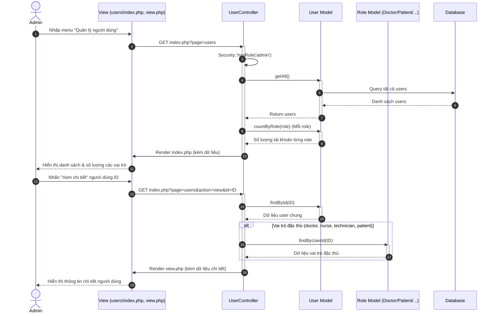
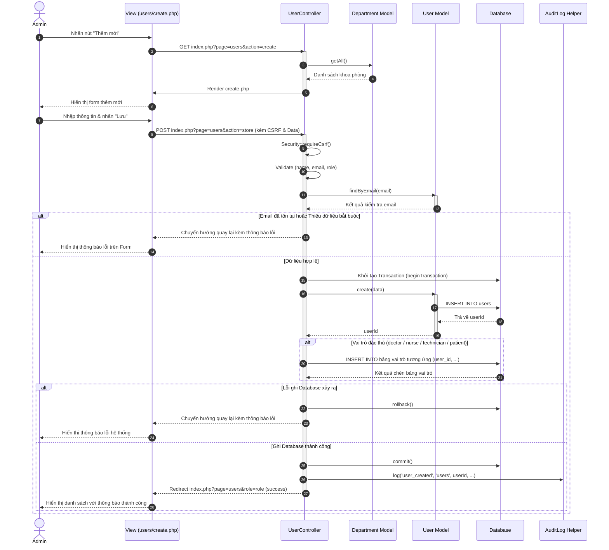
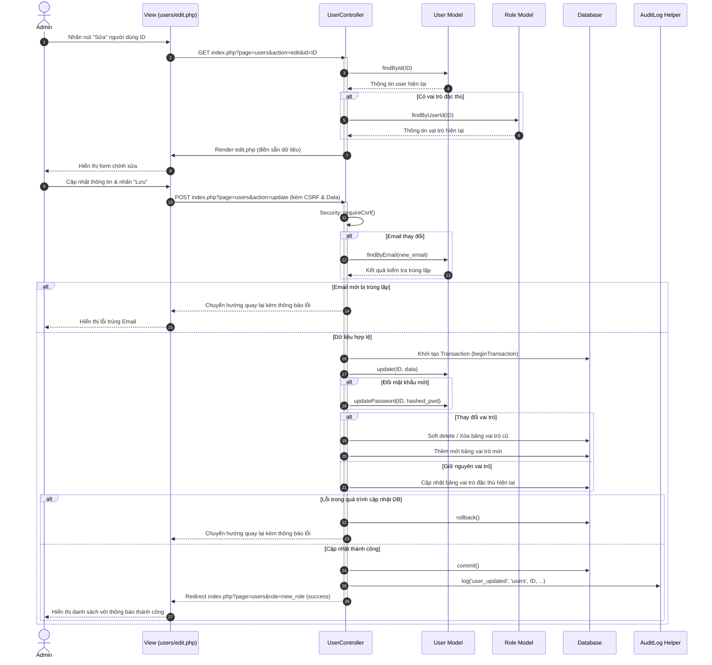
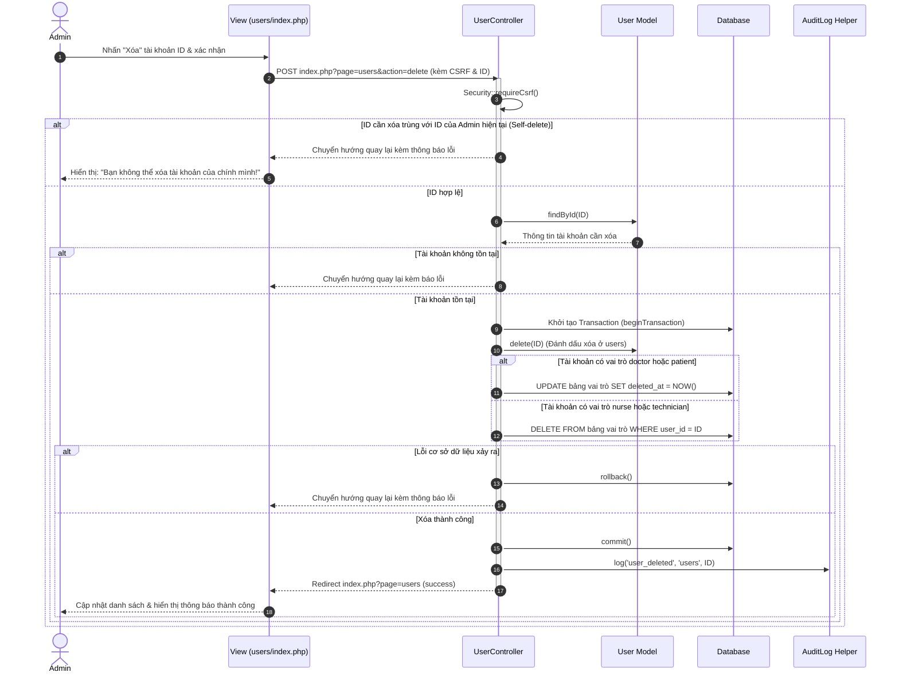

# Đặc Tả Chức Năng Quản Lý Người Dùng - NovaCare 4.0

Tài liệu này đặc tả chi tiết các Use Case thuộc chức năng **Quản lý người dùng** của hệ thống NovaCare 4.0, được xây dựng dựa trên logic và luồng nghiệp vụ thực tế triển khai trong [UserController.php](file:///d:/wamp64/www/NovaCare/controllers/UserController.php).

---

## UC-01: Xem Danh Sách và Chi Tiết Người Dùng

| | |
| --- | --- |
| **Tên use case:** | UC-01: Xem Danh Sách và Chi Tiết Người Dùng |
| **Mô tả sơ lược:** | Cho phép Quản trị viên (Admin) xem toàn bộ danh sách người dùng trong hệ thống, lọc danh sách theo từng vai trò cụ thể, và xem thông tin chi tiết (bao gồm cả thông tin chung và thông tin đặc thù theo vai trò) của một người dùng. |
| **Actor chính:** | Quản trị viên (Admin) |
| **Actor phụ:** | Không |
| **Tiền điều kiện (Pre-condition):** | Người dùng đã đăng nhập vào hệ thống với vai trò `admin`. |
| **Hậu điều kiện (Post-condition):** | Thông tin danh sách hoặc chi tiết người dùng được hiển thị chính xác. |

### Luồng sự kiện chính (main flow):

| Actor | System |
| --- | --- |
| **1.** Admin truy cập vào menu "Quản lý người dùng" từ thanh điều hướng. | **2.** Hệ thống tiếp nhận yêu cầu, kiểm tra quyền truy cập. **3.** Hệ thống thống kê số lượng tài khoản theo từng vai trò (`admin`, `doctor`, `nurse`, `technician`, `receptionist`, `pharmacist`, `cashier`, `director`, `patient`) để hiển thị số lượng trên các badge tương ứng. **4.** Hệ thống hiển thị giao diện Quản lý người dùng với danh sách toàn bộ người dùng mặc định (`role=all`). |
| **5.** Admin nhấp chọn một tab vai trò cụ thể (Ví dụ: "Bác sĩ" hoặc "Bệnh nhân") để lọc. | **6.** Hệ thống truy vấn cơ sở dữ liệu: - Nếu là bác sĩ/điều dưỡng/kỹ thuật viên/bệnh nhân: Kết nối bảng `users` với bảng vai trò tương ứng (`doctors`, `nurses`, `technicians`, `patients`) để lấy đầy đủ thông tin đặc thù. - Nếu là vai trò khác: Lọc dữ liệu trong bảng `users` theo vai trò. **7.** Hệ thống tải lại và hiển thị danh sách người dùng đã lọc. |
| **8.** Admin nhấp vào nút "Xem chi tiết" của một người dùng trong danh sách. | **9.** Hệ thống truy vấn thông tin chung của tài khoản từ bảng `users`. **10.** Hệ thống kiểm tra vai trò của tài khoản và truy vấn thêm thông tin đặc thù từ bảng tương ứng (nếu có): - `doctor`: Lấy chuyên khoa, số năm kinh nghiệm, khoa khám. - `nurse` / `technician`: Lấy khoa làm việc, chuyên môn. - `patient`: Lấy ngày sinh, giới tính, địa chỉ, nhóm máu, tiền sử bệnh án. **11.** Hệ thống hiển thị trang Chi tiết người dùng với đầy đủ thông tin. |

### Luồng sự kiện thay thế (alternate flow):

| Actor | System |
| --- | --- |
| **Luồng A1: Người dùng không có quyền admin truy cập trực tiếp qua URL** | |
| **1.** Người dùng cố tình truy cập vào URL `index.php?page=users`. | **2.** Hệ thống kiểm tra session không tồn tại hoặc vai trò không phải `admin`. **3.** Hệ thống tự động chuyển hướng người dùng về trang Đăng nhập (`index.php?page=login`) và kết thúc phiên làm việc bất hợp lệ. |
| **Luồng A2: Không tìm thấy tài khoản khi xem chi tiết** | |
| **1.** Admin bấm xem chi tiết với ID không tồn tại hoặc đã bị xóa. | **2.** Hệ thống truy vấn không tìm thấy dữ liệu. **3.** Hệ thống thiết lập thông báo lỗi: "Không tìm thấy người dùng!". **4.** Hệ thống chuyển hướng Admin quay lại trang danh sách người dùng kèm theo thông báo lỗi. |

### Biểu đồ tuần tự (Sequence Diagram):

---

## UC-02: Thêm Mới Người Dùng

| | |
| --- | --- |
| **Tên use case:** | UC-02: Thêm Mới Người Dùng |
| **Mô tả sơ lược:** | Cho phép Quản trị viên (Admin) tạo tài khoản mới cho nhân viên y tế hoặc bệnh nhân, nhập các thông tin chung của tài khoản và các thông tin đặc thù tùy thuộc vào vai trò được chọn. |
| **Actor chính:** | Quản trị viên (Admin) |
| **Actor phụ:** | Không |
| **Tiền điều kiện (Pre-condition):** | Admin đã đăng nhập hệ thống và đang ở trang Quản lý người dùng. |
| **Hậu điều kiện (Post-condition):** | Tài khoản mới được tạo thành công trong cơ sở dữ liệu và ghi nhận vào nhật ký hệ thống (Audit Log). |

### Luồng sự kiện chính (main flow):

| Actor | System |
| --- | --- |
| **1.** Admin nhấn nút "Thêm mới" trên giao diện danh sách người dùng. | **2.** Hệ thống hiển thị Form thêm mới người dùng chứa: - Các trường thông tin chung: Họ tên, Email, Số điện thoại, Mật khẩu, Vai trò. - Danh sách các Khoa/Phòng để chọn (nếu cần phân khoa). |
| **3.** Admin nhập đầy đủ thông tin chung của tài khoản và chọn vai trò cho người dùng mới. | **4.** Tùy theo vai trò Admin chọn, hệ thống tự động hiển thị thêm các trường thông tin đặc thù: - Chọn `doctor`: Hiển thị trường Chuyên khoa, Số năm kinh nghiệm, các Khoa khám. - Chọn `nurse`: Hiển thị danh sách Khoa làm việc. - Chọn `technician`: Hiển thị Khoa làm việc, Chuyên môn. - Chọn `patient`: Hiển thị Ngày sinh, Giới tính, Địa chỉ, Nhóm máu, Tiền sử bệnh lý. |
| **5.** Admin điền đầy đủ các thông tin đặc thù của vai trò (nếu có) và nhấn nút "Lưu". | **6.** Hệ thống kiểm tra tính hợp lệ của dữ liệu (Validate): các trường bắt buộc, định dạng email, kiểm tra trùng lặp email trên hệ thống. **7.** Hệ thống khởi tạo một Transaction cơ sở dữ liệu để đảm bảo tính toàn vẹn. **8.** Hệ thống thêm tài khoản vào bảng `users` và lấy ra `user_id` mới. **9.** Hệ thống thêm thông tin đặc thù vào bảng vai trò tương ứng liên kết với `user_id` vừa tạo. **10.** Hệ thống thực hiện Commit Transaction. **11.** Hệ thống ghi nhận hành động tạo tài khoản vào nhật ký hệ thống (`AuditLog::log` với hành động `user_created`). **12.** Hệ thống thiết lập thông báo thành công: "Thêm tài khoản thành công!". **13.** Hệ thống chuyển hướng Admin về trang danh sách lọc theo vai trò vừa tạo. |

### Luồng sự kiện thay thế (alternate flow):

| Actor | System |
| --- | --- |
| **Luồng A1: Bỏ trống các trường dữ liệu bắt buộc** | |
| **1.** Admin để trống Họ tên, Email hoặc không chọn Vai trò và nhấn nút "Lưu". | **2.** Hệ thống kiểm tra thấy thiếu dữ liệu bắt buộc. **3.** Hệ thống thiết lập thông báo lỗi: "Vui lòng nhập đầy đủ thông tin bắt buộc!". **4.** Hệ thống chuyển hướng Admin quay lại trang tạo mới và giữ nguyên form. |
| **Luồng A2: Email đăng ký đã tồn tại trong hệ thống** | |
| **1.** Admin nhập Email đã được tài khoản khác sử dụng và nhấn nút "Lưu". | **2.** Hệ thống kiểm tra email trong bảng `users` thấy đã tồn tại. **3.** Hệ thống thiết lập thông báo lỗi: "Email này đã được sử dụng!". **4.** Hệ thống giữ Admin ở lại trang tạo mới để điều chỉnh thông tin. |
| **Luồng A3: Lỗi hệ thống hoặc cơ sở dữ liệu khi đang ghi** | |
| **1.** Hệ thống gặp lỗi bất ngờ trong quá trình chèn dữ liệu đặc thù (ví dụ: mất kết nối, lỗi kiểu dữ liệu). | **2.** Hệ thống bắt được ngoại lệ (Exception). **3.** Hệ thống thực hiện Rollback Transaction để xóa sạch các dữ liệu tạm thời đã ghi ở bảng `users` (đảm bảo không sinh ra tài khoản rác). **4.** Hệ thống thiết lập thông báo lỗi: "Lỗi khi tạo tài khoản: [Chi tiết lỗi]". **5.** Hệ thống đưa Admin quay lại trang tạo mới. |

### Biểu đồ tuần tự (Sequence Diagram):

---

## UC-03: Cập Nhật Thông Tin Người Dùng

| | |
| --- | --- |
| **Tên use case:** | UC-03: Cập Nhật Thông Tin Người Dùng |
| **Mô tả sơ lược:** | Cho phép Quản trị viên (Admin) thay đổi thông tin chung, mật khẩu, vai trò và các thông tin đặc thù theo vai trò của một tài khoản hiện có trong hệ thống. |
| **Actor chính:** | Quản trị viên (Admin) |
| **Actor phụ:** | Không |
| **Tiền điều kiện (Pre-condition):** | Admin đã đăng nhập hệ thống và chọn một người dùng cụ thể để chỉnh sửa. |
| **Hậu điều kiện (Post-condition):** | Thông tin người dùng được cập nhật mới trong cơ sở dữ liệu, đồng bộ hóa vai trò cũ - mới và ghi nhận Audit Log. |

### Luồng sự kiện chính (main flow):

| Actor | System |
| --- | --- |
| **1.** Admin nhấn nút "Sửa" tại dòng thông tin của người dùng trên danh sách. | **2.** Hệ thống kiểm tra sự tồn tại của tài khoản. **3.** Hệ thống tải thông tin chung từ bảng `users` và thông tin đặc thù từ bảng vai trò tương ứng (nếu có). **4.** Hệ thống hiển thị Form chỉnh sửa điền sẵn các thông tin hiện tại của tài khoản. |
| **5.** Admin thay đổi các thông tin cần thiết (Họ tên, Số điện thoại, Mật khẩu mới, Vai trò, hoặc các thông tin đặc thù) và nhấn nút "Lưu". | **6.** Hệ thống kiểm tra dữ liệu đầu vào. Nếu thay đổi Email, kiểm tra xem Email mới có bị trùng lặp với tài khoản khác hay không. **7.** Hệ thống khởi tạo một Transaction cơ sở dữ liệu. **8.** Hệ thống cập nhật thông tin chung trong bảng `users`. Nếu Admin nhập mật khẩu mới, hệ thống sẽ mã hóa và cập nhật mật khẩu. **9.** Hệ thống kiểm tra sự thay đổi vai trò: - **Trường hợp đổi vai trò:** Hệ thống tiến hành đánh dấu xóa hoặc xóa hẳn dữ liệu ở bảng vai trò cũ, đồng thời chèn dữ liệu mới vào bảng vai trò mới của tài khoản. - **Trường hợp giữ nguyên vai trò:** Hệ thống cập nhật các thông tin đặc thù hiện tại ở bảng vai trò tương ứng. **10.** Hệ thống Commit Transaction. **11.** Hệ thống ghi nhận hành động cập nhật vào nhật ký hệ thống (`AuditLog::log` với hành động `user_updated`). **12.** Hệ thống thiết lập thông báo thành công: "Cập nhật tài khoản thành công!". **13.** Hệ thống chuyển hướng Admin về danh sách tài khoản theo vai trò mới. |

### Luồng sự kiện thay thế (alternate flow):

| Actor | System |
| --- | --- |
| **Luồng A1: Email thay đổi trùng với tài khoản khác** | |
| **1.** Admin thay đổi Email của người dùng thành một email đã tồn tại và nhấn nút "Lưu". | **2.** Hệ thống kiểm tra trùng lặp email phát hiện email mới đã được sử dụng. **3.** Hệ thống thiết lập thông báo lỗi: "Email này đã được sử dụng!". **4.** Chuyển hướng Admin quay lại giao diện chỉnh sửa tài khoản đó. |
| **Luồng A2: Lỗi hệ thống trong quá trình cập nhật cơ sở dữ liệu** | |
| **1.** Hệ thống gặp sự cố khi đang ghi thông tin cập nhật hoặc đồng bộ vai trò. | **2.** Hệ thống bắt Exception, thực hiện Rollback Transaction để khôi phục lại toàn bộ dữ liệu trước khi sửa. **3.** Hệ thống thiết lập thông báo lỗi: "Lỗi khi cập nhật tài khoản: [Chi tiết lỗi]". **4.** Hệ thống đưa Admin quay lại giao diện chỉnh sửa kèm thông báo lỗi. |

### Biểu đồ tuần tự (Sequence Diagram):

---

## UC-04: Xóa Người Dùng

| | |
| --- | --- |
| **Tên use case:** | UC-04: Xóa Người Dùng |
| **Mô tả sơ lược:** | Cho phép Quản trị viên (Admin) gỡ bỏ tài khoản khỏi hệ thống bằng cơ chế Soft Delete (xóa mềm), đồng thời vô hiệu hóa thông tin vai trò liên quan. |
| **Actor chính:** | Quản trị viên (Admin) |
| **Actor phụ:** | Không |
| **Tiền điều kiện (Pre-condition):** | Admin đã đăng nhập hệ thống và đang ở trang danh sách người dùng. |
| **Hậu điều kiện (Post-condition):** | Tài khoản bị ẩn khỏi các danh sách hoạt động, dữ liệu đặc thù bị đánh dấu xóa hoặc gỡ bỏ, và ghi nhận Audit Log. |

### Luồng sự kiện chính (main flow):

| Actor | System |
| --- | --- |
| **1.** Admin nhấn nút "Xóa" trên dòng thông tin của một người dùng trong danh sách và xác nhận hành động. | **2.** Hệ thống kiểm tra điều kiện bảo mật: - Đảm bảo ID tài khoản cần xóa không phải là ID của tài khoản Admin hiện đang đăng nhập. - Đảm bảo tài khoản cần xóa tồn tại trên hệ thống. **3.** Hệ thống khởi tạo một Transaction cơ sở dữ liệu. **4.** Hệ thống thực hiện Soft Delete trên bảng `users` (cập nhật cột đánh dấu xóa hoặc trạng thái). **5.** Hệ thống xử lý thông tin vai trò tương ứng: - Vai trò `doctor` hoặc `patient`: Cập nhật trường `deleted_at = NOW()` để ẩn thông tin đặc thù. - Vai trò `nurse` hoặc `technician`: Thực hiện xóa bản ghi liên kết trực tiếp khỏi bảng. **6.** Hệ thống Commit Transaction. **7.** Hệ thống ghi nhận hành động xóa vào nhật ký hệ thống (`AuditLog::log` với hành động `user_deleted`). **8.** Hệ thống thiết lập thông báo thành công: "Xóa tài khoản thành công!". **9.** Hệ thống chuyển hướng Admin quay lại danh sách người dùng. |

### Luồng sự kiện thay thế (alternate flow):

| Actor | System |
| --- | --- |
| **Luồng A1: Admin tự xóa tài khoản của chính mình** | |
| **1.** Admin cố tình thực hiện thao tác xóa tài khoản của chính mình (ID trùng với ID của session đăng nhập). | **2.** Hệ thống kiểm tra và ngăn chặn hành động. **3.** Hệ thống thiết lập thông báo lỗi: "Bạn không thể xóa tài khoản của chính mình!". **4.** Hệ thống chuyển hướng Admin quay lại trang danh sách người dùng mà không thực hiện thay đổi nào. |
| **Luồng A2: Tài khoản cần xóa không tồn tại** | |
| **1.** Thao tác xóa được gửi đi với ID tài khoản không hợp lệ. | **2.** Hệ thống kiểm tra thấy tài khoản không tồn tại. **3.** Hệ thống thiết lập thông báo lỗi: "Không tìm thấy tài khoản cần xóa!". **4.** Hệ thống chuyển hướng Admin quay lại danh sách. |
| **Luồng A3: Lỗi truy vấn cơ sở dữ liệu** | |
| **1.** Hệ thống gặp lỗi khi thực hiện câu lệnh xóa mềm hoặc xóa bảng con. | **2.** Hệ thống bắt Exception, thực hiện Rollback Transaction để bảo toàn dữ liệu tài khoản. **3.** Hệ thống thiết lập thông báo lỗi: "Lỗi khi xóa tài khoản!". **4.** Hệ thống chuyển hướng Admin quay lại trang danh sách. |

### Biểu đồ tuần tự (Sequence Diagram):

---

## Minh Họa Thiết Kế Trên Visual Paradigm

Dưới đây là biểu đồ tuần tự (Sequence Diagram) của chức năng **Thêm mới người dùng (UC-02)** được xuất bản từ không gian làm việc của **Visual Paradigm**, minh họa chi tiết luồng xử lý Transaction phức tạp:

