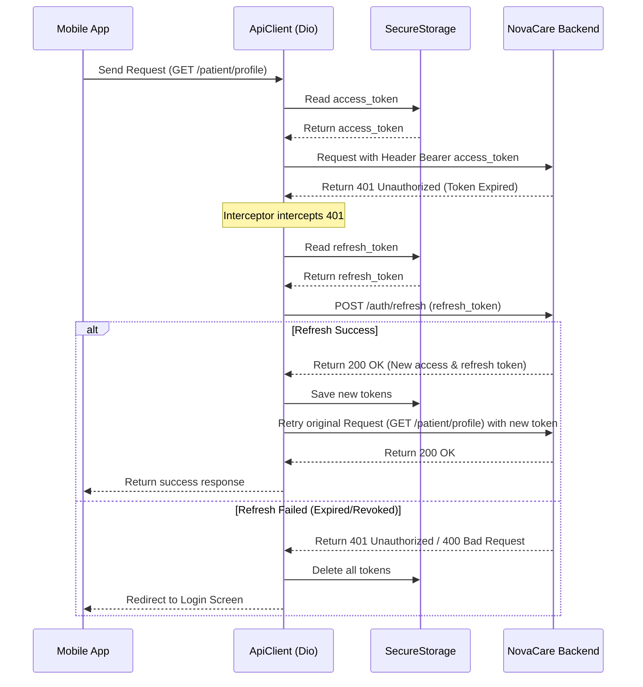

# Kế Hoạch Triển Khai Flutter Patient Mobile App MVP - NovaCare

Bản kế hoạch này đặc tả việc thiết kế, xây dựng cấu trúc dự án và lập trình Flutter Patient Mobile App MVP tích hợp 100% các REST API v1 của NovaCare.

---

## 🛠️ Danh Sách File Cần Tạo Mới & Cấu Trúc Dự Án

Chúng ta sẽ khởi tạo Flutter project mới trong thư mục `mobile/novacare_patient_app` với các cấu trúc sau:

### Core Layer (`lib/core/`):
1. `lib/core/constants/api_constants.dart` - Lưu trữ các URL endpoint và base URL (`http://10.0.2.2/NovaCare/api/v1` cho Android Emulator).
2. `lib/core/network/api_exception.dart` - Chuẩn hóa lỗi API trả về (400, 401, 403, 404, 409, 422, 500, 501, 503).
3. `lib/core/network/api_client.dart` - Dio Client tích hợp tự động gắn Token Header và tự động Refresh Token khi gặp lỗi `401 Unauthorized` qua Interceptor.
4. `lib/core/storage/secure_storage_service.dart` - Đóng gói `flutter_secure_storage` để lưu trữ access_token và refresh_token an toàn.
5. `lib/core/theme/app_theme.dart` - Thiết kế UI/UX theo tông xanh dương y tế và trắng hiện đại, góc bo nhẹ, spacing thoáng đạt.
6. `lib/core/widgets/loading_widget.dart` - Loading skeleton hoặc indicator.
7. `lib/core/widgets/error_view.dart` - Hiển thị lỗi thân thiện và hỗ trợ nút Thử Lại (Retry).
8. `lib/core/widgets/empty_state.dart` - Trạng thái trống (empty state) chuyên nghiệp.

### Routing Layer (`lib/routes/`):
1. `lib/routes/app_routes.dart` - Quản lý tên routes (named routes) và định tuyến có Auth Guard (Chưa login không vào được Home, đã login không quay về Login).

### Features Layer (`lib/features/`):
1. `lib/features/auth/` - Màn hình Splash, Đăng nhập, Đăng ký.
2. `lib/features/home/` - Dashboard tổng hợp (thông tin lượt khám hôm nay, hóa đơn chờ thanh toán, thông báo chưa đọc, nút gọi AI Chat).
3. `lib/features/profile/` - Xem và cập nhật hồ sơ bệnh nhân.
4. `lib/features/departments/` - Xem danh mục khoa phòng.
5. `lib/features/doctors/` - Xem danh sách bác sĩ, lọc theo khoa phòng và từ khóa.
6. `lib/features/appointments/` - Đặt lịch khám (chọn bác sĩ, ngày, slot trống, lý do - không gửi trường `type`), xem lịch hẹn cá nhân, chi tiết và hủy lịch.
7. `lib/features/queue/` - Theo dõi số thứ tự khám thời gian thực qua cơ chế Polling 30 giây/lần.
8. `lib/features/records/` - Xem danh sách bệnh án và chỉ số sinh hiệu chi tiết.
9. `lib/features/prescriptions/` - Xem đơn thuốc và hướng dẫn sử dụng chi tiết từng biệt dược.
10. `lib/features/invoices/` - Xem hóa đơn và gọi thanh toán VNPay.
11. `lib/features/payments/` - Tích hợp VNPay WebView thanh toán trực tuyến.
12. `lib/features/ai_chat/` - Trò chuyện triệu chứng với Trợ lý AI, xem lịch sử chat và xử lý banner cảnh báo khẩn cấp khi mức độ là `high`.
13. `lib/features/notifications/` - Xem danh sách thông báo và cập nhật trạng thái đã đọc thông báo (một hoặc tất cả).
14. `lib/features/settings/` - Đăng xuất và cấu hình app.

---

## ⚡ Thiết Kế Kỹ Thuật Quan Trọng

### 1. Token Refresh Interceptor Flow (Dio):

### 2. State Management (Provider):
Chúng ta sẽ sử dụng các Notifiers chuyên biệt kế thừa `ChangeNotifier`:
* `AuthNotifier` - Quản lý trạng thái login, đăng ký, thông tin user hiện tại.
* `HomeNotifier` - Phục vụ tổng hợp dữ liệu tại màn hình Home.
* `ProfileNotifier` - Quản lý thông tin hồ sơ và hành động update.
* `DoctorNotifier` - Quản lý danh mục khoa phòng, bác sĩ, slots trống.
* `AppointmentNotifier` - Quản lý các lịch hẹn cá nhân và đặt lịch mới.
* `QueueNotifier` - Theo dõi và polling số thứ tự khám.
* `RecordNotifier` - Load danh sách bệnh án và chi tiết.
* `PrescriptionNotifier` - Load đơn thuốc và chi tiết.
* `InvoiceNotifier` - Lịch sử hóa đơn, liên kết thanh toán VNPay và kiểm tra status.
* `AIChatNotifier` - Tải lịch sử chat y tế, gửi câu hỏi và xóa lịch sử.
* `NotificationNotifier` - Quản lý thông báo và badge chưa đọc.

---

## 📅 Quy Trình Triển Khai & Kiểm Thử Chi Tiết

### Giai đoạn 1: Chuẩn bị & Cấu hình môi trường (Không Sửa Đổi Code Laravel/PHP)
1. Tạo project: `flutter create --org com.novacare.patient mobile/novacare_patient_app`.
2. Khai báo dependencies trong `pubspec.yaml`:
   * `dio: ^5.4.0`
   * `flutter_secure_storage: ^9.0.0`
   * `provider: ^6.1.1`
   * `intl: ^0.19.0`
   * `webview_flutter: ^4.7.0`
3. Cài đặt các thư viện thông qua lệnh `flutter pub get`.
4. Chạy thử app demo trên Android Emulator để xác minh Android toolchain hoạt động.

### Giai đoạn 2: Lập trình Core Layer & Authentication
1. Cấu hình `ApiConstants`, `ApiException`, `SecureStorageService`, và `ApiClient` có Interceptor.
2. Xây dựng `AppTheme` và các widget dùng chung (`LoadingWidget`, `ErrorView`, `EmptyState`).
3. Khai báo `app_routes.dart` và `app.dart`.
4. Lập trình tính năng Đăng nhập & Đăng ký cùng cơ chế tự động chuyển hướng Splash Screen.

### Giai đoạn 3: Lập trình các Module nghiệp vụ bệnh nhân
1. **Home Dashboard:** Lời chào, tích hợp load ticket khám, hóa đơn chờ thanh toán, và badge thông báo chưa đọc.
2. **Profile:** Xem và sửa thông tin bệnh nhân.
3. **Khoa & Bác sĩ:** Hiển thị danh mục và lọc tìm kiếm.
4. **Lịch hẹn & Đặt lịch:** Đặt lịch khám, tra cứu slot khả dụng, hủy lịch, chống trùng slot (409).
5. **Số thứ tự khám (Queue):** Hiển thị chi tiết số thứ tự hiện tại, số đang gọi, số lượng chờ dự kiến và tự động polling mỗi 30 giây.
6. **Bệnh án & Đơn thuốc:** Xem danh sách, chi tiết bệnh án và chỉ số sinh hiệu, đơn thuốc kèm chi tiết biệt dược.
7. **Hóa đơn & VNPay WebView:** Danh sách hóa đơn, nút Thanh toán, gọi mở WebView VNPay, lắng nghe link return để đóng WebView và kiểm tra lại trạng thái hóa đơn trực tiếp từ Backend.
8. **AI Chat Assistant:** Gửi câu hỏi, hiển thị disclaimer, phát hiện severity high để đưa banner cảnh báo đỏ khẩn cấp, xem lịch sử chat và xóa lịch sử.
9. **Notifications:** Danh sách thông báo, đếm số chưa đọc, đọc một thông báo và đọc tất cả.

### Giai đoạn 4: Xác Minh & Báo Cáo
1. Khởi chạy app và test đầy đủ 17 luồng kiểm thử chính trên Android Emulator `emulator-5554`.
2. Cập nhật `README.md` trong thư mục mobile hướng dẫn chạy và đổi IP máy tính cho thiết bị thật.
3. Cập nhật `task.md` và `walkthrough.md`.

---

## 🔒 Quy Tắc Bảo Mật & An Toàn 
* **Không lưu token trong SharedPreferences thường**, bắt buộc dùng `flutter_secure_storage`.
* **Không log thông tin token hay dữ liệu nhạy cảm ra màn hình console** trong chế độ production.
* **Xử lý toàn bộ lỗi API thân thiện**, không hiển thị raw JSON hay stack trace cho người bệnh.
* **Tất cả text hiển thị bằng Tiếng Việt** chuẩn xác.

---

## 🙋‍♂️ Yêu Cầu Phản Hồi Từ Người Dùng
Vui lòng kiểm duyệt và cho ý kiến về kế hoạch trên:
1. Bạn có muốn đổi tông màu chính (mặc định: xanh dương y tế `#1E88E5` + trắng) sang màu khác không?
2. Có cần hỗ trợ đăng nhập nhanh bằng sinh trắc học (vân tay/Face ID) ngay trong bản MVP này không (nếu có sẽ cần bổ sung thư viện `local_auth`)?
3. Bạn đã khởi động Emulator `emulator-5554` sẵn sàng trên cổng mặc định chưa?
